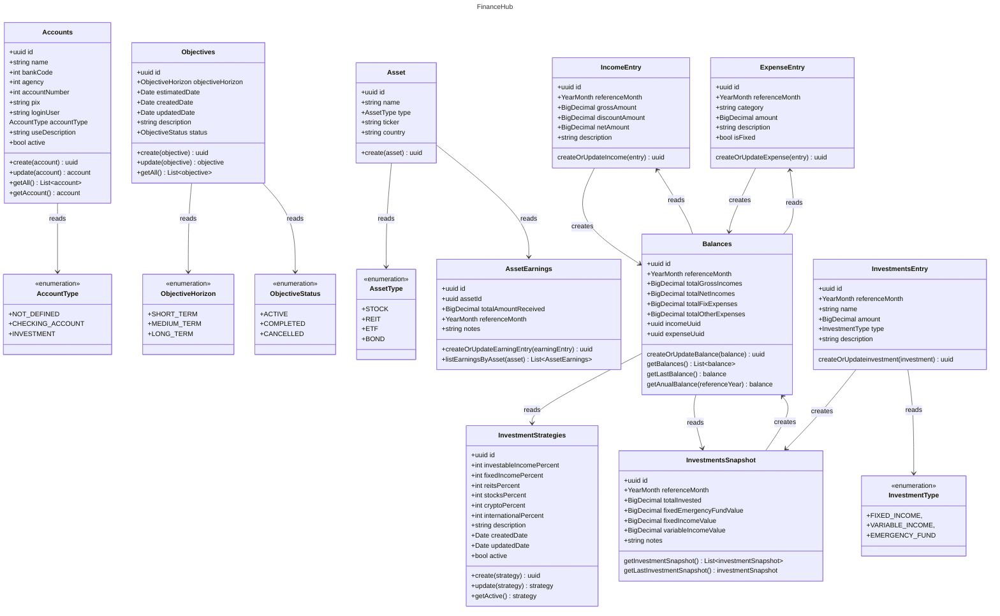

# FianceHub

FinanceHub is a personal finance management application inspired by a spreadsheet I've been using for the past few years.

The project is built using:
- Kotlin
- Micronaut
- Java 21
- PostgreSQL


## Architecture
It follows the principles of Domain-Driven Design (DDD) using a Hexagonal Architecture (Ports and Adapters), which helps to keep the domain logic isolated from external concerns such as databases and APIs.

### Domain Design Diagram


### Project architecture
````
financehub/
├── domains/
│   ├── accounts/
│   │   ├── adapters/
│   │   │   ├── input/
│   │   │   │   └── rest/
│   │   │   │       └── AccountController.kt
│   │   │   └── output/
│   │   │       └── repository/
│   │   │           └── database/
│   │   │               └── AccountRepository.kt
│   │   ├── domain/
│   │   │   ├── model/
│   │   │   │   └── Account.kt
│   │   │   └── usecase/
│   │   │       └── AccountUseCase.kt
│   │   └── ports/
│   │       ├── input/
│   │       │   └── AccountServicePort.kt
│   │       └── output/
│   │           └── AccountRepositoryPort.kt
│   ├── objectives/
│   │   ├── adapters/
│   │   │   └── ...
│   │   ├── domain/
│   │   │   └── ...
│   │   └── ports/
│   │       └── ...
│   ├── assets/
│   │   ├── adapters/
│   │   │   └── ...
│   │   ├── domain/
│   │   │   └── ...
│   │   └── ports/
│   │       └── ...
````

- domain/ – Contains the core business logic, including entities and use cases.
- ports/input/ – Defines the input contracts (interfaces) for the application's use cases.
- ports/output/ – Declares output contracts for external dependencies such as databases, caches and APIs.
- adapters/input/ – Implements entry points like REST controllers, CLI commands, or event listeners.
- adapters/output/ – Implements integrations with external systems such as databases, caches, and APIs.

### Importing sample data
There is an importer script under `/scripts/financehub-importer` built in Golang
- To import data:
  - Create a file `/scripts/financehub-importer/resources/financehub_import.xlsx` using `financehub_import-sample.xlsx` as example;
  - Run `make up`
  - Run `make import`
